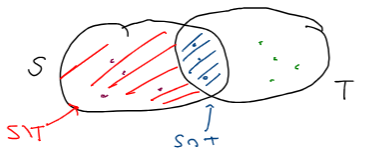
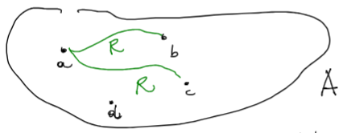
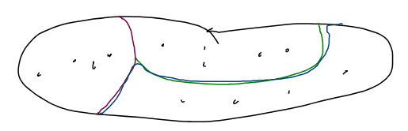

## Lez1 - 2024-03-04 - Insieme, Sottoinsieme, Insieme delle parti, Operazioni sugli insiemi, Prodotto cartesiano, Coppia ordinata, Relazioni tra insiemi, Relazione di equivalenza, Classe di equivalenza

## Insiemi

Un insieme è una **collezione di oggetti**, detti elementi che soddisfa le seguenti caratteristiche:

- è possibile **stabilire** se un elemento **appartiene** ($\in$) all'insieme
- gli elementi devono essere tutti **distinti** tra loro

### Insiemi importanti

- Insieme vuoto: $\emptyset$
- Numeri interi: $\mathbb{Z}$
- Numeri reali: $\mathbb{R}$
- Numeri complessi: $\mathbb{C}$
- Numeri razionali: $\mathbb{Q}$

_Esempio:_ insiemi importanti per l'informatica:

- Linguaggio: insieme finito di _simboli_ ($\lbrace a, \dots, z, +, -, ; \rbrace$)
	- insieme delle _stringhe finite_ composte utilizzando i _simboli di questo insieme_
	- ci sono tante stringhe finite che _non portano a nulla_ (non sta comunicando niente)
	- nell'insieme linguaggio è importante capire quali portano ad un risultato _(sono compilabili)_

## Sottoinsieme

Un insieme $T$ è detto **sottoinsieme** di un insieme $S$ se **tutti** gli elementi di $T$ fanno anche parte di $S$: $T \subseteq S$.

_Esempio:_

- $\mathbb{N} \subseteq \mathbb{R}$
- Numeri interi pari $\subseteq$ Numeri interi
- Stringhe compilabili $\subseteq$ Linguaggio(S)

### Sottoinsieme proprio

Un **sottoinsieme proprio** $T$ di un insieme $S$ è un sottoinsieme che è strettamente incluso, ovvero $T$ è **diverso** da $S$: $T \subset S$.

## Insieme delle parti

Dato un insieme I, definiamo $P(I)$ come l'**insieme delle parti**, ovvero l'**insieme dei sottoinsiemi** di $I$:
$$\lbrace T \ | \ T \subseteq I\rbrace$$

_Esempio:_

- $I = \lbrace0,1,2,3\rbrace$
	- $P(I) = \lbrace\emptyset, \lbrace0\rbrace, \lbrace1\rbrace, \lbrace2\rbrace, \lbrace3\rbrace, \lbrace0,1\rbrace, \lbrace0,2\rbrace, \lbrace0,3\rbrace, \dots, I \rbrace$
	- $4 \choose 2$ _numero_ dei sottoinsiemi di 2 elementi di un insieme di 4 elementi

### Da _Insieme_ al suo _Insieme delle parti_

Operazione non ancora definita, che ci fa passare da un **insieme** al suo **insieme delle parti**: $\lbrace\text{insiemi}\rbrace \rightarrow \lbrace\text{insiemi} \rbrace$
$$I \rightarrow P(I)$$

Questa operazione può essere applicata di nuovo al proprio risultato, in modo **ricorsivo**:
$$I \rightarrow P(I) \rightarrow P(P(I)) \rightarrow \dots$$

Una proprietà di questa operazione è che la _cardinalità crescerà_ sempre in modo _stretto_.

## Descrivere gli insiemi

È possibile **descrivere** un insieme in due modi:

- **elencando** gli elementi: $\lbrace 0, +1, +2 ,-2, +3, -3\rbrace$, è possibile solo quando l'insieme è finito
- usando delle **condizioni**: $I = \lbrace x \ | \ x \text{ soddisfa condizioni} \rbrace$

_Esempio:_

- insieme dei numeri pari:
	- $\lbrace x \ | \ x \in \mathbb{Z} \land 2 \text{ divide } x \rbrace$
- insieme di tutti i numeri naturali minori o uguali a 5:
	- $\lbrace0,1,2,3,4,5\rbrace$
	- $\lbrace x \ | \ x \in \mathbb{N} \land x \leq 5 \rbrace$
	- per **dimostrare** che le due descrizioni **sono uguali**, è necessario dimostrare che gli elementi di $A$ sono tutti e soli gli elementi di $B$, ovvero che $A \subseteq B \land B \subseteq A$

## Operazioni sugli insiemi

È possibile effettuare delle operazioni sugli insiemi, dati due insiemi $S$ e $T$, le più importanti sono:

- **unione**: $S \cup T = \lbrace x \ | \ x \in S \lor x \in T \rbrace$
- **intersezione**: $S \cap T = \lbrace x \ | \ x \in S \land x \in T \rbrace$
- **differenza**: $S \textbackslash T = \lbrace x \ | \ x \in S \land x \notin T \rbrace = S \textbackslash S \cap T$

## Prodotto cartesiano

Dati due insiemi $A$ e $B$, definiamo il **prodotto cartesiano** $\times$ come insieme di tutte le _coppie ordinate_:
$$A \times B := \lbrace(a,b) \ | \ a \in A \land b \in B\rbrace$$

Se $A$ e $B$ sono finiti, allora:

- anche il prodotto cartesiano è **finito**
- sia $h$ il numero di elementi di $A$ e $k$ il numero di elementi di $B$, allora $A \times B$ ha $h \cdot k$ elementi

Più in generale, è possibile effettuare il prodotto cartesiano **tra $n$ insiemi**:
$$A_1 \times A_2 \times \dots \times A_n = \lbrace (a_1, a_2, \dots, a_n) \ | \ a_1 \in A_1, a_2 \in A_2, \dots, a_n \in A_n\rbrace$$

_Esempio_:

- $A = \lbrace0,1,2\rbrace$, $B = \lbrace0,2,4\rbrace$
	- $A \times B = \lbrace (0,0), (0,2), (0,4), (1,0), (1,2), (1,4), (2,0), (2,2), (2,4)\rbrace$
- $A = B = \mathbb{R}$
	- $A \times B = \mathbb{R} \times \mathbb{R} = \mathbb{R}^2$, ovvero il piano cartesiano

### Coppia ordinata

Per dare la definizione di prodotto cartesiano, serve la definizione di **coppia ordinata** $(-,-)$:
$$a \in A, b \in B \quad (a,b) := \lbrace \lbrace a \rbrace, \lbrace a,b \rbrace \rbrace \subseteq P(A \cup B)$$

ovvero, una coppia ordinata è un **elemento dell'insieme delle parti** dell'insieme delle parti di $A$ unione $B$: $P(P(A \cup B))$.

È importante sottolineare che $(a,b) \neq (b,a)$. $(b,a)$ è definito su $\lbrace \lbrace b \rbrace, \lbrace a,b \rbrace \rbrace$.

_Esempio:_

- un elemento di $\mathbb{R}^2$, ovvero un punto del piano cartesiano

## Relazioni tra insiemi

Dati due insiemi $A$, $B$, vorremmo definire un modo per "**associare**" elementi di $A$ e di $B$.

_Esempio:_

- $A = B = \mathbb{Z}_{> 0}$, vogliamo associare ad ogni elemento di $A$ i suoi divisori
- $A = \lbrace \text{rette in } \mathbb{R}^2 \rbrace, B = \lbrace \text{punti in } \mathbb{R}^2 \rbrace$, vogliamo associare i punti che appartengono alla retta

**Definizione:**

Una **relazione** (binaria) tra $A$ e $B$ è un **sottoinsieme** $R \subseteq A \times B$.

Gli **elementi** della relazione $R$ sono: $\lbrace (a,b) \in A \times B \ | \ (a,b) \in \mathbb{R}\rbrace$ e si esprimono con la notazione $a \sim_{R} b$ oppure $a R b$.

_Esempio:_

- $A = \mathbb{Z}, B = \mathbb{R}$
	- $R = \lbrace(a,b) \ | \ b^2 = a\rbrace$: relazione che cerca quali numeri reali sono radici di numeri interi
	- $(1,1), (1,-1) \in R$
	- $(0,3) \notin R$
- $A = B = P(\mathbb{Z})$
	- $R = \lbrace(S,T) \ | \ S \subseteq T \rbrace$: relazione che cerca quali insiemi sono sottoinsiemi di un altro insieme
	- $(\mathbb{Z}, \lbrace\text{numeri pari}\rbrace) \notin R$
	- $(\lbrace\text{numeri pari}\rbrace, \mathbb{Z}) \in R$
	- $(\emptyset, \lbrace1,2,3\rbrace) \in R$

## Proprietà delle relazioni

Sia $R \subseteq A \times A$ una **relazione**. Diciamo che $R$ è:

- **riflessiva**: $\forall a \in A, \quad a \sim_R a$
- **simmetrica**: $\forall a,b \in A, \quad a \sim_R b \Rightarrow b \sim_R a$
- **antisimmetrica**: $\forall a, b \in A, \quad a \sim_R b \land b \sim_R a \Rightarrow a = b$
- **transitiva**: $\forall a, b, c \in A, \quad a \sim_R b \land b \sim_R c \Rightarrow a \sim_R c$

_Esempio:_

- $A = \lbrace 0,1,2,3 \rbrace$, $R = \lbrace (0,0), (2,1), (1,2), (3,0)\rbrace$

Quali proprietà sono soddisfatte da $R$ su $A$?

- riflessività: $(1,1 \notin R)$, quindi NON è riflessiva
- simmetria: $(3,0) \in R, (0,3) \notin R$, quindi NON è simmetrica
- antisimmetria: $(2,1), (1,2) \in R, 1 \neq 2$, quindi NON è antisimmetrica
- transitività: $(2,1), (1,2) \in R, (2,2) \notin R$, quindi NON è transitiva

## Relazione di equivalenza

- sia $R \subseteq A \times A$ una relazione

Diciamo che $R$ è una **relazione d'equivalenza** quando è:

- **riflessiva**
- **simmetrica**
- **transitiva**

_Esempio:_

- $A = \mathbb{R}$, $R \subseteq \mathbb{Z}^2 = \lbrace (a,b) \ | \ a-b \text{ è divisibile per 3}\rbrace$
- riflessiva: $\forall a \in \mathbb{Z}, a - a$ è divisibile per $3$
	- $a-a = 0$
	- $0$ è divisibile per $3$
- simmetrica: $\forall a,b \in \mathbb{Z} \ | \ a-b$ è divisibile per $3$
	- $a-b = 3 \cdot k$ per qualche $k \in \mathbb{Z}$
	- $b-a = 3 \cdot (-k)$ per qualche $k \in \mathbb{Z}$
	- quindi implica che anche $(b,a) \in R$
- transitività: $(a,b) \in R \land (b,c) \in R \Rightarrow (b,c) \in R$
	- $a-b = 3k, k \in \mathbb{Z}$
	- $b-c = 3j, j \in \mathbb{Z}$
	- $a-c = 3q, q \in \mathbb{Z}$
		- $a-c = a-b + b-c$
		- $a-c = 3k + 3j$
		- $a-c = 3(k+j)$
		- $q = (k+j)$

## Classe di equivalenza

La **classe di equivalenza** di un elemento $a$ rispetto ad una relazione $R$ sono tutti gli **elementi in relazione** con $a$:
$$\lbrace b \in A \ | \ a \sim_R b \rbrace$$

**Proprietà**:

- $a \in CL(a)$, **riflessiva**
- $b \in CL(a) \Rightarrow a \in CL(b)$, **simmetrica**
- $c \notin CL(a) \Rightarrow CL(a) \cap CL(c) = \emptyset$, **transitiva**

**Teorema**:

- sia $A$ un insieme
- sia $R \in A \times A$ una relazione di equivalenza

$$A = \amalg \text{ classi di equivalenza}$$

ovvero l'insieme $A$ è l'**unione** di tutte le **classi di equivalenza** _($A$ è partizionato nelle classi di equivalenza)_, che sono tra loro **disgiunte**.

